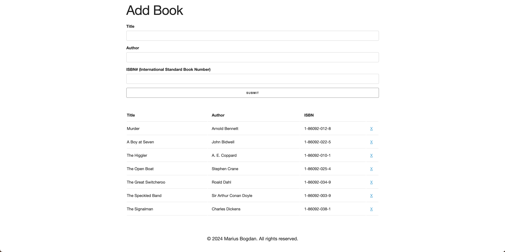

# Book List
[](#)

> A simple web application that allows users to add, view, and manage books in a structured list.

## Overview
**Book List** is a user-friendly web-based application that enables users to add books by entering their title, author, and ISBN number. The books are displayed in a structured table format, and users can remove them when needed. The project is designed to offer a simple and efficient way to manage a book collection.

## Preview
<p align="center">
  
</p>

## Features
- **Add Books:** Users can input book details such as title, author, and ISBN.
- **Book Display:** Books are shown in a structured table format for easy management.
- **Delete Functionality:** Users can remove books from the list with a single click.
- **Local Storage Support:** Saves book data locally to persist even after page refresh.

## Live Demo
**Explore the live version here:** [View Live Demo](https://marius-bogdan.com/projects/book-list/)

## Local Setup
1. **Clone** the repository:
   ```bash
   git clone https://github.com/MIBogdan/book-list.git
   ```
2. **Open** the `index.html` file in your browser
   *- or use a local development server (like VS Code Live Server) for a smoother development experience.*

---

## Author
**Marius Bogdan**  
[Personal portfolio](https://marius-bogdan.com/)

Feel free to reach out for any questions or collaborations!

## License

This project is provided for testing and demonstration purposes only. All rights are reserved. No part of this project may be redistributed, reuploaded, or used in any manner (commercially or otherwise) without explicit written permission from the author.
